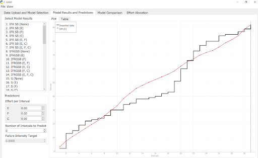
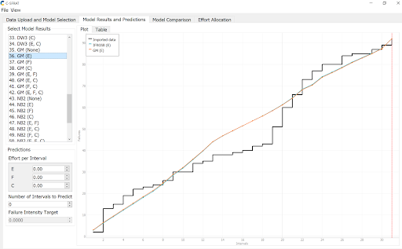
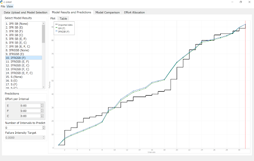
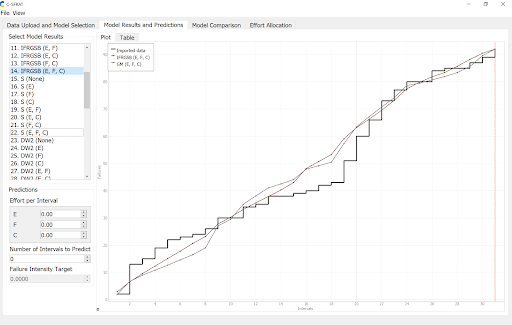
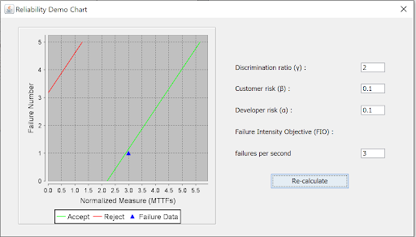
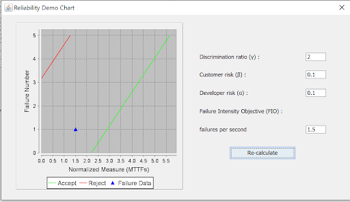
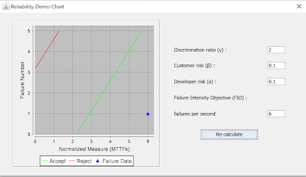

**SENG 438- Software Testing, Reliability, and Quality**

**Lab. Report \#5 – Software Reliability Assessment**

| Group \#:       | 37                     |
|-----------------|---                     |
| Student Names:  | Dominic Vandekerkhove  |
|                 | Alexander Varga        |
|                 | John Cedric Acierto    |
|                 | Ivan Tompong           |

# Introduction
This lab consists of analyzing test data through reliability assessment tools. We will be assessing failure data via reliability growth testing and a reliability demonstration chart (RDC). We will be using C-SFRAT to analyze the reliability growth of the given test data and SRTAT to analyze the reliability demonstration chart. 
# 

# Assessment Using Reliability Growth Testing 

C-SFRAT allowed us to compare the various sequence models with the Model Comparison feature where we could view how each model fit with the failure data. This is how we decided on the two best models. This figure displays the correspondence of the test data to a geometric model in reference to the computational failure time. It follows that the provided failure data is tracked fairly well by a geometric sequence of the computational model. It is apparent in the following diagrams that the sequence models selected sequence models (geometric and IFR generalized Salvia and Bollinger) resemble the data failure rate when they are calculated in reference to all three parameters. 

This figure demonstrates the correlation between the data set and two sequence models referencing the execution time between each failure. Again, the sequence models are the geometric model and the IFR generalized Salvia and Bollinger. Both sequence models are very similar, however, they slightly differ between intervals 2 to 10, and 22 to 26. In the lower range, the geometric model tracks the data failure slightly better than the IFRGSB model. In the upper interval, the opposite is true. 

This figure models the data failure rate with our selected sequence models using the physical time between intervals as the parameter. This parameter models the data failure rate the best with these selected models. From the graph, it can be seen that the models are most similar at higher intervals, however, they all follow the similar trend. 

This is a final graph we created reflecting the trend from all three parameters. Similar to all three graphs before this, the sequence models closely reflect the failure rate from the provided data at higher intervals (> 20) although the models only slightly resemble the failure data in the lower intervals, it is reasonable to expect refined performance at higher intervals in testing. Also, the sequence models are fairly accurate in intervals 8-14. This diagram depicts the average structure between the three parameters and thus reflects that the sequence models we chose are accurate, even though the models for particular parameters may not reflect as such.
# Assessment Using Reliability Demonstration Chart 

Assuming a developer and customer risk tolerance of 1 failure every 10 seconds, and a discrimination ratio of 2, this system will just be accepted with a failure intensity objective (FIO) of 3 failures per second. This means that if the customer and developer require the program to run with a maximum of 1 failure every 10 seconds. The discrimination ratio reflects the amount of error within this calculation is accepted. It directly correlates to the space between the acceptance line and the rejection line. So, for this software to be accepted by developers and customers, it must achieve an FIO of at least 3 failures per second. 

This figure reflects the effect of cutting the FIO in half. Here, the failure data lies in the ‘continue’ portion of the graph, signifying that that with the specified FIO, the data does not pass or fail the risk requirements but rather is undetermined due to the permissible error established by the discrimination ratio. If the discrimination ratio was decreased, this failure data likely would be rejected.

This RDC reflects the effect of doubling the FIO. Here, the failure intensity objective is 6, resulting in failure data that greatly exceeds the acceptance rate. As stated previously, a failure intensity objective greater than 3 would result in an accepted failure rate. So, an FIO of 6 surely exceeds developer and customer expectations. 
# 

# Comparison of Results
From the plots in part one, an estimation of a failure intensity objective can be drawn. We can see from the plots that the least number of failures is at 0 intervals and the most failures are at the final interval. With this, we can calculate the slope of a linear failure intensity objective. Here, the final interval has accumulated roughly 95 failures. Given that this is the 30th interval, we can calculate a slope of 95/30=3.2 . This gives us a very rough estimate of the minimum failure intensity objective to ensure the failure data is accepted. In part two, we calculated that the minimum failure intensity objective to accept the failure data was 3, so these results are fairly close. It should also be noted that our approximation made for part 1 is linear and the region in intervals 18-20 still fall underneath the interval, so this estimation is certainly higher than the actual value. 
# Discussion on Similarity and Differences of the Two Techniques
Similarities
Both techniques allowed us to analyze the failure rates of the test data visually with reference to expected values. 
Differences
Performing reliability growth testing allowed us to visualize the entire data set over its time range while the RDC only allowed us to compare the test data with accepting and rejecting conditions.
Reliability growth testing focuses on increasing the systems reliability to a desired point, whereas RDC is focused on showcasing the reliability of the system

# How the team work/effort was divided and managed
For this lab, we divided the work into two sections (part one and two) and had two team members working on each part. For the reliability growth testing, one person used C-SFRAT and created graphs while the other person analyzed the graphs and wrote descriptions. We followed a similar strategy for the reliability demonstration chart.
# 

# Difficulties encountered, challenges overcome, and lessons learned
All difficulties encountered involved the provided software files. SRTAT and the Reliability Demonstration Chart Excel sheet did not work as they are set out to in the lab handout. This is discussed in further detail in the feedback section. In the end, we had to use C-SFRAT for part one and SRTAT for part two.
# Comments/feedback on the lab itself
This lab has honestly been the most difficult, solely due to technical difficulties with the resources provided. The SRTAT did not accept the CSV file that was provided in the lab artifacts and even after aimlessly reformatting the data set, the SRTAT program failed to execute. The other programs that were mentioned were also tested and either did not work on MAC or failed to accept the data set. Since there were minimal instructions given in the lab document, this was a difficult issue to navigate. This rendered some team members useless, so their attention was redirected to part 2 of the document. After reading the RDC document and opening the excel sheet, the instructions seemed fairly straight forward, except that the document did not have the expected functionality. As most of the document was in a protected view, most of the instructions were impossible to complete. It was impossible to add data into the cumulative failure count column which was particularly important.
